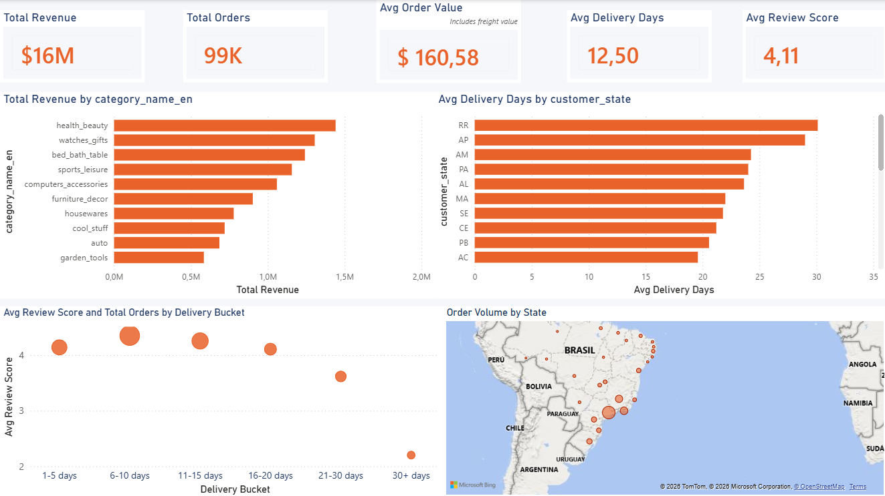
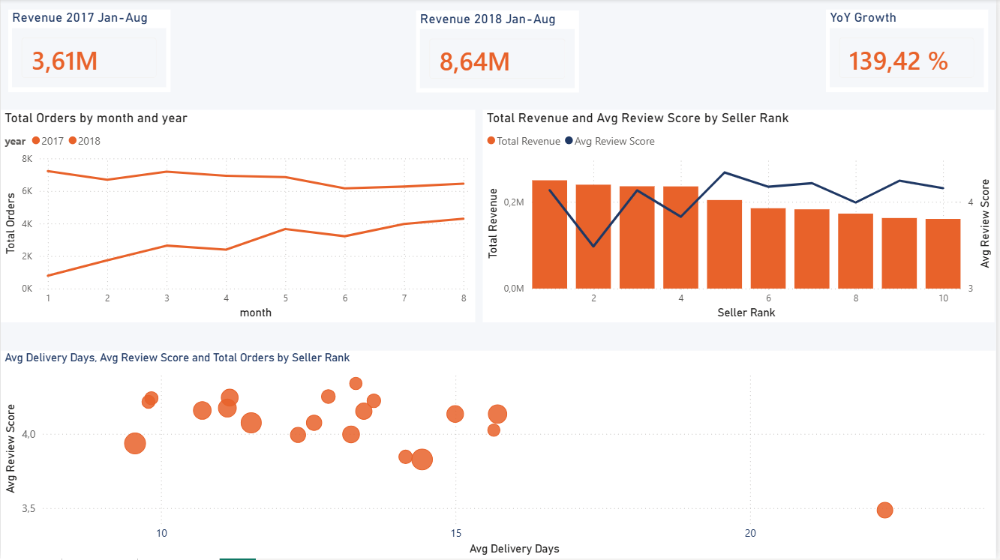
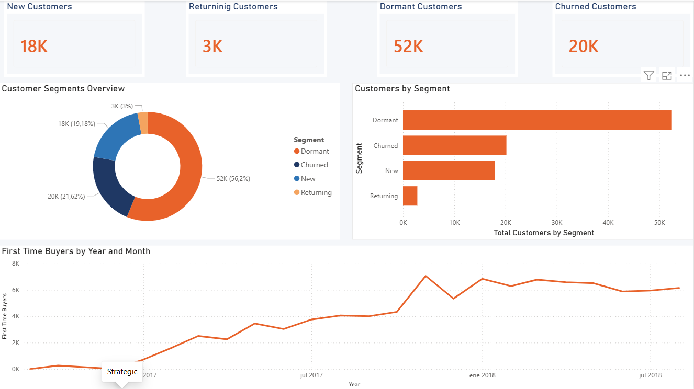

# Brazilian E-Commerce Descriptive Analytics — Olist

**Part of a three-project AWS analytics portfolio targeting e-commerce and retail roles.**

This project applies descriptive analytics to the [Olist Brazilian E-Commerce dataset](https://www.kaggle.com/datasets/olistbr/brazilian-ecommerce) — 100,000 orders placed between 2016 and 2018 across a Brazilian marketplace. The goal was not to build dashboards for the sake of it, but to let the data define the questions worth asking. Every design decision in this project, from the segmentation logic to the YoY comparison window, came out of diagnostic SQL queries run before touching Power BI.

---

## The Data Story

Three findings shaped the entire project:

**1. Delivery speed is the strongest predictor of customer satisfaction.**
Orders delivered in 1–5 days average a review score of 4.4. Orders taking 30+ days drop to 2.2. The relationship is nearly linear at roughly 0.25 review points per additional 5 days of delivery time. This is not a correlation buried in a model — it is visible in a scatter plot.

**2. The business scaled structurally in Q4 2017.**
Revenue grew 139.42% comparing January–August 2017 to the same period in 2018. More importantly, November 2017 triggered a Black Friday spike that the business never fell back from. January 2018 opened at a volume that took all of 2017 to reach.

**3. Olist is an acquisition business, not a retention business.**
Only 3% of customers placed more than one order. This is not a failure — it reflects the product mix (furniture, electronics, home goods) where repurchase cycles are long. The strategic question is not "how do we retain customers" but "how do we convert dormant buyers before they churn permanently." 56% of the customer base made one purchase between 90 days and one year ago — that is the addressable segment.

---

## Dashboards

### Operational — Delivery Performance Monitoring



Answers the question: *how is the operation performing right now?*

The top metrics tell a clean story: $16M revenue, 99K orders, 12.5 average delivery days, 4.11 average review score. The delivery days by state chart reveals that northern states (RR, AP, AM) consistently average 25–30 days — more than double the southeastern average. The scatter plot makes the delivery-satisfaction relationship impossible to miss.

> Design decision: order status was excluded from this dashboard. 97.8% of orders are "delivered" — a bar chart of that distribution is noise, not insight.

---

### Tactical — YoY Growth and Seller Analysis



Answers the question: *is the business growing, and who is driving it?*

The YoY comparison is limited to January–August in both 2017 and 2018. The dataset ends in August 2018, so a full-year comparison would show a false decline. Comparing equivalent periods gives a clean 139.42% revenue growth figure that is honest and defensible.

The seller combo chart exposes a tension worth investigating: Seller #2 is the second-highest revenue generator but has the lowest review score (3.35) and the longest delivery time (22 days) among the top 10. High revenue and poor customer experience in the same seller is an operational risk.

> Design decision: seller IDs are SHA-256 hashes. A calculated rank column was added to make the axis readable without losing the ability to drill into individual sellers.

---

### Strategic — Customer Segmentation and Acquisition Trends



Answers the question: *who are our customers and where is growth coming from?*

Standard RFM segmentation was rejected for this dataset. With 78% of customers making a single purchase, a "loyalty" framework distorts reality. Instead, customers are classified by recency relative to the dataset's end date (August 29, 2018):

| Segment | Definition | Count |
|---------|-----------|-------|
| New | 1 order, last 90 days | 18K |
| Returning | 2+ orders, any period | 3K |
| Dormant | 1 order, 90 days–1 year ago | 52K |
| Churned | 1 order, 1+ year ago | 20K |

The acquisition curve shows consistent monthly growth throughout 2017, a Black Friday spike in November, and a step-change in January 2018 that sustained ~6,000 new customers per month through August. The business did not just grow — it reached a new operating level and held it.

---

## Technical Architecture

```
Kaggle CSVs
    └── S3 (raw/)
        └── AWS Glue ETL Job
            └── S3 (processed/ — Parquet)
                └── AWS Glue Crawler
                    └── Athena (olist_catalog)
                        └── Power BI (ODBC via Amazon Athena DSN)
```

### Star Schema

Seven tables in `olist_catalog`:

| Table | Rows | Role |
|-------|------|------|
| `fact_orders` | 112,650 | Central fact table (order × item grain) |
| `dim_customer` | 99,441 | Customer dimension |
| `dim_product` | 32,951 | Product dimension |
| `dim_seller` | 3,095 | Seller dimension |
| `dim_date` | 634 | Date dimension |
| `dim_payment` | 99,440 | Payment dimension |
| `dim_geography` | 27,912 | Geography (disconnected — see below) |

### AWS Infrastructure

- **Account**: DereckMontreal14 (ca-central-1)
- **S3**: `s3://olist-ecommerce-ca-dc/` with `raw/`, `processed/`, `features/`, `athena-results/` prefixes
- **Glue**: Two crawlers (`crawler-olist-raw`, `crawler-olist-processed`), one ETL job (`etl-olist-star-schema`)
- **Athena**: Database `olist_catalog`, results written to `athena-results/`
- **Power BI**: Connected via Amazon Athena ODBC 2.x DSN

---

## Technical Decisions and Trade-offs

**dim_geography disconnected from the model.**
The geography table has duplicate `zip_code_prefix` values that prevent a clean relationship. Geographic analysis uses `customer_state` and `customer_city` from `dim_customer` directly, which is sufficient for state-level aggregations. Coordinate data (`geo_lat`, `geo_lng`) is available in `dim_customer` for map visuals.

**dim_payment joined on order_id, not payment_key.**
The intended join key (`payment_key`) did not produce a clean relationship due to how payment sequences are structured in the source data. The join on `order_id` works correctly with only 3 null matches across 112,650 rows. This is documented as technical debt — a production pipeline would resolve this at the ETL layer.

**YoY comparison limited to January–August.**
The 2018 data ends in August. Comparing full-year 2017 to partial-year 2018 would produce a misleading decline in Q4. The 139.42% growth figure is calculated on equivalent periods only.

**Customer segmentation uses dataset max date as reference.**
The dataset ends on August 29, 2018. All recency thresholds (90 days, 365 days) are calculated relative to that date, not to the current date. This makes the segmentation reproducible and honest about the data's temporal scope.

**2016 data excluded from trend analysis.**
Only 267 delivered orders were recorded in 2016 versus 43,000+ in 2017. Including 2016 in time-series visuals distorts scale without adding analytical value.

---

## Repository Structure

```
├── etl/
│   └── etl_olist_star_schema.py       # Glue ETL job
├── sql/
│   ├── validation_queries.sql         # Athena validation queries
│   └── segmentation_analysis.sql      # Customer segmentation logic
├── powerbi/
│   └── olist_theme.json               # Custom Power BI theme (#1F3864 / #E8622A)
├── screenshots/
│   ├── Operational.png
│   ├── Tactical.png
│   └── Strategic.png
└── README.md
```

---

## Stack

`AWS S3` · `AWS Glue` · `Amazon Athena` · `Power BI Desktop` · `DAX` · `SQL` · `Python`

---

*Part of a portfolio also including a wellness churn prediction pipeline ($1.37M ARR identified) and a purchase propensity scoring model for Canadian retail (XGBoost ROC-AUC 0.7793, 45% CRM list reduction).*
